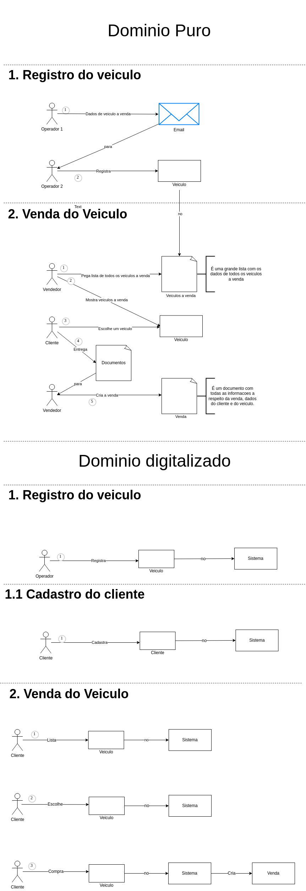
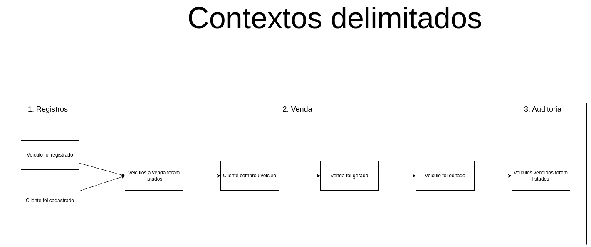

# FIAP - SOAT-POSTECH - Atividade substitutiva

## Descricao

Esse serviço é responsavel pela manipulação de veiculos, clientes e vendas. Ele utiliza arquitetura hexagonal para poder separar melhor as responsabilidades de cada etapa e ser possivel implementar novas funcionalidades de maneira mais facil. Ele sobe um server http e distribui as chamadas entre os 3 dominios diferentes de acordo com a rota: /veiculo, /cliente, /venda
A linguagem obiqua está sendo respeitada e o que foi discutido no momento do event storming e definições de palavras chave estão sendo devidamente implementadas no código.

## Features

- CadastrarCliente

- RegistrarVeiculo
- ListarVeiculosAVenda
- ListarVeiculosVendidos
- EditarVeiculo

- CriarVenda

## Como rodar localmente

É possivel buildar localmente as imagens para posteriormente utiliza-las no docker-compose, ou utilizar diretamente as imagens do repositório remoto:

Opção 1 para api: 
    $```docker build -t api . -f Dockerfile```

Opção 1 para db:
    $```docker build -t db . -f Dockerfile.db```

Opção 2 para ambos:
    $```make run-app```

ou rode manualmente o comando: $```docker-compose -f build/db-docker-compose.yaml up -d```

Ambos terão o mesmo resultado.

## Testando a api manualmente

No diretorio api é possivel encontrar uma collection contendo todos os endpoints da aplicação.

## Build + Bake Image

O Dockerfile criado para a aplicação trabalha com duas etapas, a primeira cria um container para que seja possivel executar o build da aplicação e gerar seu respectivo binário, em seguida é executado outro container que pega o binário gerado e o coloca em uma outra imagem menor.

# Linguagem Obiqua

## Documentação da Linguagem Ubíqua

### Introdução
A linguagem ubíqua é um vocabulário comum utilizado por todos os membros da equipe para garantir que todos entendam e se comuniquem de forma consistente sobre os conceitos e processos do domínio de negócio. Esta seção define os principais termos e conceitos utilizados na plataforma de revenda de veículos automotores.

### Termos e Definições

### Veículo
- **Descrição:** Um automóvel disponível para venda ou vendido na plataforma.
- **Atributos:**
  - **Marca:** Fabricante do veículo (ex: Ford, Chevrolet).
  - **Modelo:** Modelo específico do veículo (ex: Fiesta, Onix).
  - **Ano:** Ano de fabricação do veículo.
  - **Cor:** Cor do veículo.
  - **Preco:** Preço de venda do veículo.
  - **Disponivel** Se o veiculo esta disponivel ou nao

### ListarVeiculosAVenda
- **Descrição:** Exibição dos veículos disponíveis para venda.
- **Eventos Relacionados:** veiculos a venda foram listados.

### ListarVeiculosVendidos
- **Descrição:** Exibição dos veículos que já foram vendidos.
- **Eventos Relacionados:** veiculos vendidos foram listados.

### RegistrarVeículo
- **Descrição:** Processo de adicionar um novo veículo à plataforma para que esteja disponível para venda.
- **Eventos Relacionados:** Veículo foi registrado.

### EditarVeículo
- **Descrição:** Processo de atualizar as informações de um veículo já cadastrado na plataforma.
- **Eventos Relacionados:** Veículo foi editado.

### Cliente
- **Descrição:** Um cliente usuario da plataforma.
- **Atributos:**
  - **Nome:** Nome da pessoa que comprou o veículo.
  - **Documento:** CPF da pessoa que comprou o veículo.
  - **Data:** Data de cadastrado.

### CadastrarCliente
- **Descrição:** Processo de cadastrar clientes na plataforma.
- **Eventos Relacionados:** Cliente foi cadastrado.

### Venda
- **Descrição:** Uma venda gerada pela plataforma.
- **Atributos:**
  - **Nome do Cliente:** Nome da pessoa que comprou o veículo.
  - **Documento do Cliente:** CPF da pessoa que comprou o veículo.
  - **Data:** Data em que a venda foi efetuada.
  - **Veiculo** Veiculo que foi comprado

### CriarVenda
- **Descrição:** Processo de criar uma nova venda à plataforma.
- **Eventos Relacionados:** cliente comprou veiculo; venda foi gerada.

## Atores

### Operador
- **Descrição:** Pessoa responsável por cadastrar e editar veiculos na plataforma.

### Cliente
- **Descrição:** Pessoa que compra um veículo através da plataforma.

## Domain Storytelling



## Diagramas do Event Storming

### BrainStorming


### Linhas do Tempo


### Eventos Pivotais



### Contextos Delimitados (Com agragados, comandos, politicas, etc)

